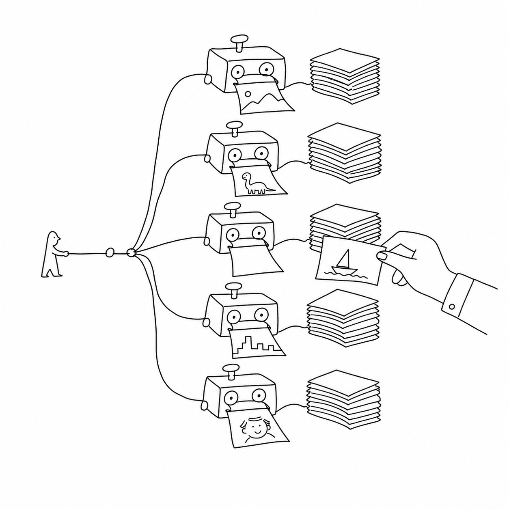

<!-- this_file: README.md -->

# vexy-dexypy

**Turn any web page into slide decks — several at once — and keep the slides you
like.**



vexy-dexypy takes one URL, figures out where the slides hiding inside the page
should break, and renders it to PDF through several engines in parallel. Each
engine writes its own folder of single-page PDFs. You skim the folders and build
your final deck from the best version of each slide: the hero from one engine,
the text-heavy slides from another. No two engines paginate a page the same way,
and that's the whole point — you get a menu, not a verdict.

It runs offline after the first fetch, it's a Python CLI, and it delegates DOM
preprocessing to a companion JavaScript package `vexy-dexyjs` running in the browser.

> Status: **core pipeline implemented, engines maturing.** The six-stage pipeline
> — read, analyze, normalize, prepare, render, write — runs end to end against
> the Playwright, Vivliostyle and reveal.js engines, with an offline test suite
> over fixtures. The design lives in [`spec/`](spec/00-tldr.md) (24 chapters);
> remaining work is tracked in [`TODO.md`](TODO.md).

## Why it exists

Web pages are infinite vertical scrolls; slides are fixed 16:9 rectangles.
Forcing one into the other with a naive "print to PDF" cuts headings in half and
orphans images. vexy-dexypy paginates *intelligently* — it renders the page at the
real slide size, watches where the browser actually breaks content, and snaps
slide boundaries to sections and headings instead of arbitrary pixel rows.

Then it refuses to pick a winner. A Webflow hero looks best through Chromium; a
documentation page looks best through a pure-CSS print engine. vexy-dexypy runs
them all and lets you choose.

## How it works

A six-stage pipeline, orchestrated in Python, shelling out to browser and Node
engines where they do the job better:

1. **Read** — fetch the HTML and localize assets so it works offline. Supports dynamic
   fetching via standard Playwright, `playwrightauthor` (persistent sessions), or
   `cloakbrowser` (stealth Chromium).
2. **Analyze** — recognize the page (Webflow, MkDocs Material, …) and plan the
   slide breaks at your target aspect ratio.
3. **Normalize** — restructure the DOM into clean, slide-shaped sections inside the browser
   using the companion JS package `vexy-dexyjs`.
4. **Prepare** — inject the paged-media CSS / reveal.js wrapping each engine
   wants.
5. **Render** — export to PDF through every chosen engine, in parallel.
6. **Write** — split each PDF into named single-page slides, optionally as SVG,
   with an HTML preview to browse.

The companion JavaScript package `vexy-dexyjs` (under `./vexy-dexyjs/`) can be deployed to NPM/CDNs
and is also suitable for building Chrome extensions or external integrations. It handles in-browser
DOM preprocessing and integrates the best "offlinization" / inlining tools.

The full design is 24 chapters in [`spec/`](spec/00-tldr.md); the tool decisions
and their rationale are in [`RESEARCH.md`](RESEARCH.md).

## Planned usage

```bash
# Everything, every available strategy, default 720p
vexy-dexypy build https://www.vexy.art/lines/

# Pick strategies and aspect ratio, also emit SVGs
vexy-dexypy build https://blog.fontlab.com/ \
    --strategies vivliostyle,playwright --aspect 1080p --svg

# Re-run a single stage on an existing PDF
vexy-dexypy split out/lines/playwright/_combined.pdf --out out/lines/playwright --svg
```

Output lands as:

```
out/lines/
  playwright/   01-slide.pdf  02-slide.pdf  …  index.html
  vivliostyle/  01-slide.pdf  …
  reveal/       01-slide.pdf  …
  _meta/        slideplan.json  run-summary.json
```

A failed engine degrades to a warning — the run still gives you the decks that
worked, and tells you how to fix the one that didn't.

## What it recognizes

- **Webflow** — preprocessed using `vexy-dexyjs` in the browser, which generalizes the
  [`webflow2reveal`](https://github.com/twardoch/webflow2reveal) transform: each section becomes
  a slide, chrome is dropped, backgrounds are classified light/dark.
- **MkDocs Material** — extracts the content column, splits by heading, keeps
  code blocks and tables intact.
- **Everything else** — a generic path extracts the article body and splits by `<h2>` or
  breaks. Bubble, Docusaurus, and Framer get light-touch rules.

New frameworks are plugins in `vexy-dexyjs` / `vexy-dexypy`, not core changes.

## The engines

| Strategy | Engine | Best for |
|---|---|---|
| `playwright` | Headless Chromium | Webflow, JS-heavy, highly styled pages |
| `vivliostyle` | Chromium typesetting | Long-form / documentation, strong paged media |
| `reveal` | Native reveal.js (Playwright + pypdf) | The reveal.js path, crisp per-slide capture |
| `prince` | PrinceXML (opt-in) | Reference-quality paged media, if you have a licence |

Install only what you want — a strategy whose tool is missing is skipped with a
note, never a crash.

## Optional: smarter breaks with a local vision model

For pages with no clean structure, vexy-dexypy can ask a small local
vision-language model (MiniCPM-V 4.6 via Ollama or llama.cpp) to refine the slide
breaks from a screenshot. It's strictly opt-in (`--vision`), cached, and never
required.

## Requirements (planned)

- Python 3.12+, installed with `uv`.
- Playwright Chromium (`playwright install chromium`).
- Optional: `playwrightauthor` (locally cloned), `cloakbrowser`.
- Optional: Node (for Vivliostyle CLI and `vexy-dexyjs` bundlers), `monolith`, poppler (for
  SVG, pulled in by `vexy-pdfsvgpy`), Prince, and Ollama/llama.cpp for vision.

## Project layout

```
spec/           # the 24-chapter specification (start at 00-tldr.md)
research/       # the source research reports
RESEARCH.md     # synthesized conclusions and tool decisions
IDEA.md         # the original concept, kept in sync
TODO.md         # actionable task list, linked to spec chapters
CLAUDE.md       # guidance for AI coding agents / contributors
vexy-dexyjs/    # the browser preprocessor javascript package
```

## Contributing

Read [`spec/00-tldr.md`](spec/00-tldr.md) and [`CLAUDE.md`](CLAUDE.md) first. The
spec is the contract: implement against a chapter, and if you must deviate,
update that chapter in the same change. Tests run offline against fixtures; every
function gets one.

## Licence

See [`LICENSE`](LICENSE). Note the dependency licence hazards documented in
[spec/24](spec/24.md) (Vivliostyle and PyMuPDF are AGPL; Prince is proprietary)
— vexy-dexypy shells out to AGPL engines rather than linking them.
